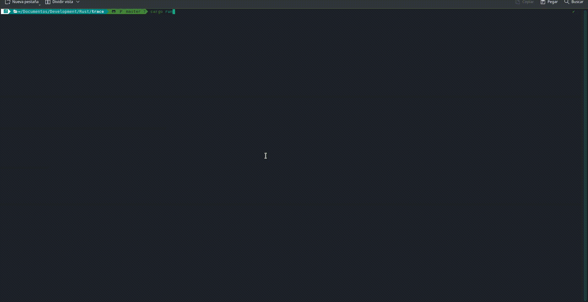

# TRace Game
A simple typing TUI racer with the main focus being the spanish language.


## Installation
You can install it with `cargo install trace-game`. You'll need to download the [database.csv file](database.csv) for the default runs. If you want to add runs or create your own database.csv file you can! Just run the program from another directory where the database.csv is and you're good to go. All data is stored in a `.user` and `.runs.csv` file that will appear next to the `database.csv` file.

## Features
- Statistics
- Written in rust so it's bLaZinGLy fAsT.
- By default the database only has texts in spanish but you only need to modify the databse.csv file adding anything you'll like and it should work. The chars recognized by the app are:

```rs
'a', 'b', 'c', 'd', 'e', 'f', 'g', 'h', 'i', 'j', 'k', 'l', 'm', 'n', 'o', 'p', 'q', 'r', 's', 't', 'u', 'v', 'w', 'x', 'y', 'z' // and upper case variants

'á', 'é', 'í', 'ó', 'ú', 'ä', 'ë', 'ï', 'ö', 'ü', 'ñ', // and upper case variants

'ç', ' ', ',', '.', ':', '"', '-', '@', ';', '<', '>', '+', '-', '_', '(', ')', '=', '*', '/', '¡', '!', '¿', '?', '#', '$', '%', '&', '°', '\'', '^', '~', '[', ']', '{', '}',

'1', '2', '3', '4', '5', '6', '7', '8', '9', '0'
```

## Roadmap
- The bar chart currently only shows the quantity that fits the screen. There should be a command to navigate through records.
- Probably make the installation process a little easier.
- I plan to add local multiplayer but this will take a while.